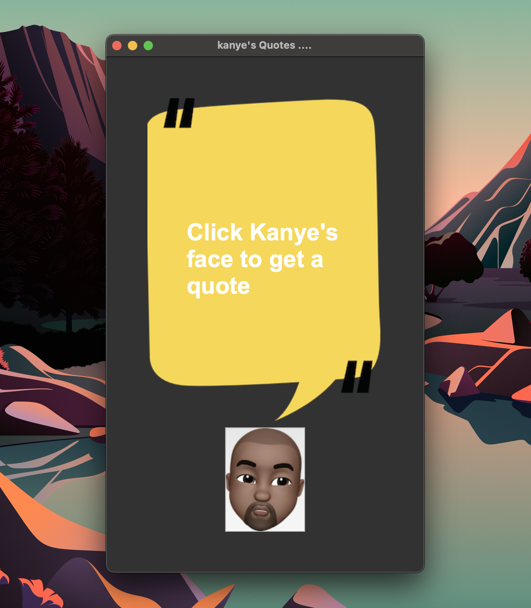

# 🎤 Kanye Quotes GUI App

A simple and fun Python GUI application that displays random quotes from Kanye West using the Kanye REST API. Built using Tkinter.

## 🧠 Features

- Fetches real-time Kanye West quotes
- Clickable GUI with dynamic quote display
- Background and button images for a fun look

## 🛠️ Tech Stack

- Python 3
- Tkinter (GUI)
- `requests` (API calls)
- Kanye REST API

## 📦 Requirements

Install dependencies with:

```bash
pip install requests
```

# Also, include the following image files in your project directory:
 - background.png
 - kanye.png

🚀 How to Run
```bash
python main.py
```
*Then click on Kanye’s face to see what he has to say.*

## Skills
- **GUI development with Tkinter**
- **REST API integration**
- **Event-driven programming**
- **Image handling in Python GUIs**

### Screenshots

-------------------------------


